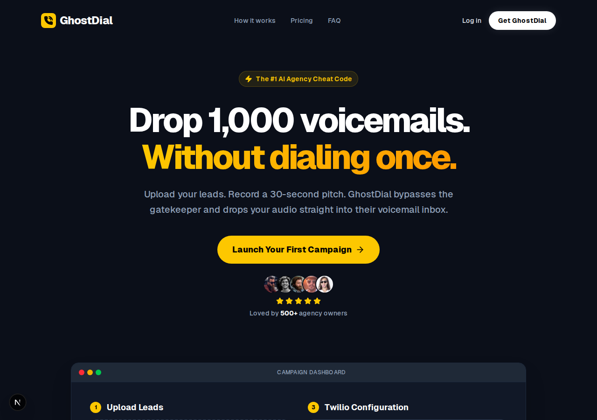

<div align="center">
  
  <h1>GhostDial</h1>
  <p><b>The Open-Source, BYOK (Bring-Your-Own-Key) Ringless Voicemail Engine.</b></p>
  
  [](https://opensource.org/licenses/MIT)
  [](https://nextjs.org/)
  [](https://react.dev/)
  [](https://tailwindcss.com/)
  [](http://makeapullrequest.com)

  <br />
</div>

## 🚀 The Cheat Code for Cold Outreach

Agency owners pay upwards of **$97 to $297/month** for Ringless Voicemail SaaS products that do exactly this. 

**GhostDial is a 100% free, open-source alternative.** 
You plug in your own Twilio API keys, upload a CSV of leads, and drop thousands of ringless voicemails without dialing a single phone number. Bypass the gatekeeper and land straight in their inbox for pennies.



## ✨ Features

- **Bring Your Own Key (BYOK):** No middleman markups. Pay Twilio directly (fractions of a cent per call).
- **Bulk CSV Upload:** Easily import massive lead lists from your CRM or scrapers.
- **Answering Machine Detection (AMD):** Smart Twilio integration ensures voicemails are only dropped when it hits an inbox, not a live human.
- **ShipFast Brutalist UI:** Built for speed and conversion with a modern, high-contrast, Marc Lou-inspired dashboard.
- **Edge-Ready Webhooks:** Handles async Twilio callback state.

---

## 🛠️ Quick Start

GhostDial is built on **Next.js** and **Tailwind CSS**. Getting it running locally takes 60 seconds.

### 1. Clone & Install
```bash
git clone https://github.com/eskayML/ghost-dialer.git
cd ghost-dialer
npm install
```

### 2. Run the Development Server
```bash
npm run dev
```

### 3. Open the App
Navigate to [http://localhost:3000](http://localhost:3000). 
Upload your `.csv`, paste your audio URL, drop in your Twilio keys, and start blasting!

---

## 🤝 Contributing

We want to make GhostDial the absolute best open-source cold outreach tool on GitHub. We gladly welcome issues and pull requests!

**How you can help:**
1. **Frontend Tweaks:** Add progress bars, status badges for successful drops, or better mobile responsiveness.
2. **Backend Optimization:** Improve the Twilio TwiML AMD handling for faster drops.
3. **Database Integration:** Hook up Supabase or Firebase to save campaign history and past uploads.
4. **Docs:** Improve this README with a setup guide for creating a Twilio account!

### To Submit a PR:
1. Fork the repo.
2. Create a feature branch: `git checkout -b feature-cool-new-thing`
3. Commit your changes: `git commit -m 'Added a cool new thing'`
4. Push to the branch: `git push origin feature-cool-new-thing`
5. Open a Pull Request.

---

## 📝 License

This project is licensed under the **MIT License**. You are free to use it, modify it, and even commercialize it. 

*If you make millions dropping voicemails with this, maybe toss us a star on GitHub! ⭐*